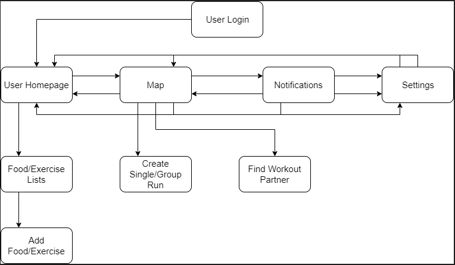

# RouteFit

RouteFit presents itself as an answer to improve upon the user experience of the common fitness app. RouteFit aims to
offer a social experience for users from which they can interact and workout together. This app aims to be a strong competitor in
its respective space by incorporating the common functionality of traditional fitness apps, and adding new twists like the aformentioned
social experience, as well as an integrated Google Maps platform. This map functionality allows the user to plan running routes directly
on the map, and gives them directions to help them navigate safely.

## Group members

| Name                   | Banner ID  | Email               |
| ---------------------- | ---------- | ------------------- |
| Victor Popoola               | B00755206  | popoolaV@dal.ca     |
| Dylan Roberts              | B00740784  | dylanroberts@dal.ca     |
| Jayden Macdonald               | B00736511  | jy477274@dal.ca     |

## Description

The purpose of RouteFit is to provide a more social aspect to the common Calorie tracking and fitness application.
The application incorporates common themes in fitness apps like counting calories and tracking workout habits, as
well as showing the user trends over time. RouteFit also allows users to find and interact with one another using the 
map functionality. The motivation a user may have to use RouteFit over another application is the fact that some people
prefer to go on fitness journeys with others. Our application provides them with a method to meet like-minded people,
and make fitness a more exciting and social experience.

### Users

The target userbase of RouteFit are people of any age that have active lifestyles. These people would be 
looking for a social experience as well as having a way to stay on track with their goals. 

As the app has not yet been localized into languages other than English, it is intended for use by users
who understand the English language. Future work for this application could include localization for different regions.

The software is intended to be used indoors and out. The user can use the application while at the gym, or 
in an on-the-go style environment like while on a run. It is designed such that a user can choose to take 
advantage of the application's social features, or simply use it as a calorie tracking app.


### Features

- Plan a route to run/walk on, see estimated calorie burn for this route.

- Track daily calorie intake and burn by adding different foods and excercise.

- Find people around you that also use RouteFit.

- Sort users by your preference of physical activity. The users that display on the map will share these interests as well.

- See current location on route, up to date GPS position.

- Receive notifications to remind you to enter the food you have consumed around meal times.

- Receive notifications about users around you.

- Receive a notification when a run has started.

- Have the option to display yourself to others, or remain private.

- When the user is out on a run, the application can give them voiced directions so they can know where to go without needing to look at their device.


## Libraries

Provide a list of **ALL** the libraries you used for your project. This should include
sources of any clip art, icons, etc. Example:

**google-gson:** Gson is a Java library that can be used to convert Java Objects into their JSON representation. It can also be used to convert a JSON string to an equivalent Java object. Source [here](https://github.com/google/gson)

**Google Places API:** This was used to get place names in our application.

**Google Directions API:** We used this for the voiced directions component of our application

**Fused Location Provider:** We used this to get live location updates for the device.

**Firebase Firestore Libraries:** These were used to integrate our app with Firestore so we can easily add and retrieve data.

**Android Text to Speech:** We used this in the map activity to provide the user with spoken directions on a run.

**Bottom Sheet:** This was used in the map activity in order to display extra information to the user in a way that it can easily be hidden if the user wants more screen space for the map.

**Bottom Navigation Bar:** This was used so the user can efficiently switch between the top-level fragments of our application.

**Images/Icons:** Images used in the project are liscenced under free use in the public domain from https://www.pexels.com/public-domain-images/


## Requirements


- Android 5.0, GPS access

- Location updates using Fused Location Provider, technically this doesn't have a minimum requirement, but it is better to work on devices that are able to use updated versions of Google Play Services.

- The Google Places API requires at least Android 16.0

- The Google Directions API requires at least Android 19.0

## Installation Notes

There are no specific installation steps needed other than using the supplied APK, we are using several API keys that are required to make
the map functionality work properly so if any of this is not working please contact us at your latest convenience.


## Final Project Status


The final status of our project is that we have completed all minimum and expected functionality.
We started work on one item in the bonus functionality which was the food notification. We have a setting that
edits a user preferences singleton which holds the user's choice of whether or not they want to receive this notification.

On top of completing the majority of our proposed functionality, we saved time to perform some UI polishing, and testing the app
for edge case errors around user input fields. When developing the app, we tried to make as many fields as possible selections or pickers to
minimize user input error.

If we were to continue this project, the next task would naturally be the running group system, and a login so
we can test the viability of the app for true users rather than just testing using mocks as we are right now. For the above 
mentioned food notification, we had found a firebase messaging function in which firebase sends notifications to the device at specified times.
We could use this to send the food notification 3 times a day at common meal times, since this notification requires a server to send the information rather
than being generated from a specific action from the application.


### Minimum Functionality

- The user should be able to track their daily calorie intake.

- The user should be able to select from a list of common foods and have the calorie information be automatically added to their daily intake list. (Implemented)

- The user should be able to specify how long they exercised per day to subtract from their daily calorie total (e.g. exercising for 1 hour may subtract 150 calories on average)  (Implemented)

- The user should be able to use the map function to plan running/walking routes and see the approximate calorie burn for the route they select.  (Implemented)

- Average calorie burn can be calculated by the average walking/running speed of a person and how long the distance they are going to travel.  (Implemented)

- After completing the route, the estimated calorie burn for that route is automatically subtracted from their daily calorie total.  (Implemented)

- While on their run, the user should be able to determine where they are on the map (live GPS location update).  (Implemented)

- The map function will utilize the device’s gyroscope to react to the user’s directional movement, and to let the system know the user made a turn for navigational purposes.  (Implemented)


### Expected Functionality
- The user should be able to see other users around them and can determine whether or not other users are looking for a workout buddy. (Implemented)

- The user should be able to send a notification to the x number of users around them that they are looking for someone to workout with. (Implemented)

- Depending on a user’s interests, they can specify a filter in their settings that allows them to see potential partners on the map that want to do the same thing as them. (e.g. filter for people wanting to go for a run or for those wanting to go to the gym).  (Implemented)

- Users who do not want to receive these notifications set their status to ‘not looking for a partner’, as opposed to ‘looking for a partner’. This status will appear in their profile.  (Implemented)

- Application sends a notification to the user when they have started a route (Implemented)

- To augment the map function, we will add a voice functionality to tell the user what direction to go in so they don’t have to look at the map while running.  (Implemented)


### Bonus Functionality

- The user should receive notifications to remind them to add to their calorie intake list. The user can turn these notifications on or off.  (Partially Implemented)

- The map function should take elevation into account to calculate a better calorie burn for routes.  (Not Implemented)

- The user should be able to have a secure login.  (Not Implemented)

- The app could integrate with android wear and other wearable tech to keep track of the user’s health information (heart rate, steps, etc.).  (Not Implemented)

- The user can create weekly and monthly calorie/exercise goals.  (Not Implemented)

- The user should be able to specify whether they did light, medium, or heavy exercise to better calculate the calorie burn for their exercising time.  (Not Implemented)

- The user should be able to cache map information on the device to use while running. This will mitigate some of the issues they may have with limited connectivity.  (Not Implemented)

- A user should be able to create, or join a running group for a predetermined route. The run/walk will start when a certain number of users have either entered the same area as the user who created the group. This function will use GPS to determine if the users that signed up for a group run are close enough for the run to begin.  (Not Implemented)

- Users can also be alerted to walk/run waiting rooms nearby, or opt out of these notifications if they wish.  (Not Implemented)


## Code Examples


**Problem 1: Swipe to delete on RecyclerViews**

Initially, we had a delete button on each item in the recyclerview which on press would remove the item 
from the recycler view and the database. This was a bit cumbersome since the buttons needed to be small to fit in
the list item cardview, which could be an annoyance to the user. A more mobile solution is to use a swiping gesture to delete 
items from the list when they are swiped off the screen. Below is an example of how we used the 
ItemTouchCallback to implement this functionality.

```
private fun handleFoodSwipeDelete() {
        val itemTouchCallback = object : ItemTouchHelper.SimpleCallback(0,
            ItemTouchHelper.LEFT or ItemTouchHelper.RIGHT){

            override fun onMove(
                recyclerView: RecyclerView,
                viewHolder: RecyclerView.ViewHolder,
                target: RecyclerView.ViewHolder
            ): Boolean {
                return false
            }

            override fun onSwiped(viewHolder: RecyclerView.ViewHolder,
                                  direction: Int) {
                foodListAdapter!!.deleteItem(viewHolder.adapterPosition)
            }
        }

        val itemTouchHelper = ItemTouchHelper(itemTouchCallback)
        itemTouchHelper.attachToRecyclerView(nFoodRecyclerView)
    }
    
//source: Drag and Swipe with RecyclerView [3]    
```

**Problem 2: Displaying User Info on the Map**

Google maps provides methods to set a title and subtitle (a snippet) on a map marker that displays
when it is clicked. However, this was not what we really wanted in terms of displaying the user's data on the map.
Our solution for this was implementing an Info Window that shows the user's name, profile picture, and what type of 
workout they would prefer to do. Shown below is the code used to draw markers on the map and a custom Info Window class.

```
fun drawMarkers() {

        nDatabase.collection("UserList").get()
            .addOnSuccessListener { result ->
                for (doc in result) {
                    user = doc.toObject(User::class.java)
                    //if the user's status is 'looking for partner'

                    if(user.status == 0 && user.preference == UserPreferences.preference){
                       // Log.d("Log1", user.name)
                        mMap.addMarker(MarkerOptions()
                            .position(LatLng(user.location!!.latitude, user.location!!.longitude))
                            .title(user.name)
                            .snippet(user.preference)
                            .infoWindowAnchor(0.5f, 0.5f))

                    }
                }
            }.addOnFailureListener { exception ->
                Log.d("Debug", "", exception)
            }

    }
    
    
 private inner class CustomInfoWindowAdapter : GoogleMap.InfoWindowAdapter {

    private val infoWindow: View = layoutInflater.inflate(R.layout.map_marker_info_window, null)
    private val windowContents: View = layoutInflater.inflate(R.layout.info_window_contents, null)

    override fun getInfoWindow(p0: Marker?): View {
        showWindow(p0, infoWindow)
        return infoWindow
    }

    override fun getInfoContents(p0: Marker?): View {
        showWindow(p0, windowContents)
        return windowContents
    }
}

```

**Problem 3: Notifications**

We had some issues building notifications at first, this is because we did not include
the notification channel setup. On newer android devices, applications are required to reserve a channel
from which they can generate notifications that are visible device wide. This channel is setup when the activity that
will generate notifications is created. We sent the title and content of the notification up to firebase so we can display
to the user what notifications they have received in-app on the notifications fragment.


```
fun showNotification(title: String, content: String) {

        /**
         * Send notification data to firebase for display in the notifications fragment
         */
        val documentReference: DocumentReference = nDatabase.collection("NotificationList").document()
        val notification = Notification(title, content)
        notification.id = documentReference.id
        documentReference.set(notification)

        /**
         * Build notification
         */
        var builder = NotificationCompat.Builder(this, "RouteFit")
            .setSmallIcon(R.drawable.ic_notifications_black_24dp)
            .setContentTitle(title)
            .setContentText(content)
            .setPriority(NotificationCompat.PRIORITY_DEFAULT)

        with(NotificationManagerCompat.from(this)) {
            // notificationId is a unique int for each notification that you must define
            notify(342, builder.build())
        }

    }

    private fun notificationChannel() {
        if (Build.VERSION.SDK_INT >= Build.VERSION_CODES.O) {
            val channelName = "route fit"
            val importance = NotificationManager.IMPORTANCE_DEFAULT
            val channel = NotificationChannel("RouteFit", channelName, importance)
            val notificationManager =
                getSystemService(Context.NOTIFICATION_SERVICE) as NotificationManager
            notificationManager.createNotificationChannel(channel)
        }

    }
```


## Functional Decomposition


On the top level, our application is composed of 4 main activities. These are the homepage, the map,
notifications, and settings. The homepage contains the user's food and exercise trackers as well as daily calorie
counts. The map contains the partner system functionality, as well as the functionality to create and go on
a run. On a basic level, the map uses the gyroscope and the device's GPS in order to get an accurate measure of 
the user's location. The routing functionality makes use of Google's Places, and Directions API's, as well
as Android text to speech to give the user directions on the routes the choose. These two main settings, along with
the Notifications activity, all interface with firebase to store and retrieve information. The Settings activity
provides the user with a way to personalize the app to their tastes, but these settings are stored locally and not
in the database.

## High-level Organization


## Clickstreams



## Layout

Below are some rough wireframes that highlight the main portions of our applciation


Above is a basic idea of what our login UI would look like if implemented. Very simple
with a place for a username and password. If implemented we could make this look more sleek with
a nice title image and coloured background that suits our application.


This wireframe highlights the fact that the map activity is to take up the majority of the space on the screen.
We can see the navigation bar below which the user uses in the real application to flip between tasks.


This was the initial design for the user's homepage. There is space if needed to draw graphs for user goals and progression,
(bonus functionality) and buttons for them to reach their food and exercise lists.


This wireframe shows what our in-app notifications fragment will look like. It is a simple RecyclerView
that displays the notifications that the user has received.


This shows a basic form of our settings fragment. It is kept simple, with checkboxes, toggles, and option pickers in our applciation,
much like a settings page in many other android applications.

## Implementation

Screenshots of all the primary views (screens) and a brief discussion of the
interactions the user performs on the screens.


The homepage contains the user's calorie counts for the day, as well as views containing their food and exercise lists.
The user can use a swipe to delete gesture to delete these items. They can add food and exercises to their lists by pressing the 'Add Food'
or 'Add Exercise' buttons respectively. They are then brought to an activity where they can add information from the app's database of food and exercises.
The bottom of the screen cap shows the navigation bar from which the user can access other top level pieces of the application.


This image shows the main views in the Maps Activity. When it is opened, the map focuses in on the user's current location and shows icons representing users
nearby that share the same workout preferences as the user. From here, the user can tap a location which places a marker. When the play button is pressed after this marker 
has been laid, a route is drawn between the user and the selected point, and information about the destination as well as directions to the destination are displayed
on a Bottom Sheet.

If the user were to tap one of the user icons, an Info Window with some information about the selected user is displayed.


The notifications fragement is a simple RecyclerView that displays the notifications the user has received. The user can swipe to delete old items.


From the settings fragment, the user can set certain prefereces that affect how other things in the app are displayed, or what notifications they will
receive. When a setting is changed, it updates a value in a UserPreferences singleton, which then allows us to update the app based on what the user wants to see.
From the settings fragment, the user can select their preferred workout partner type, whether or not they are visible to other users (this also affects receiving notifications 
about other users) and whether or not they want to receive notifications reminding them to enter information into the calorie counter (bonus functionality).

## Future Work

In the future, we would like to implement a lot of the functionality in the bonus section of our project contract.
We believe there are many things in there that would further augment our application and make it even more competitive
in the fitness app space. One of the things that would be interesting to implement from this section is integration with 
wearable technology like Android wear. This would allow our application to have a well integrated hands-free component, and allow
it to be a more viable on-the-go product.

We have partially implemented the Food Notification in the bonus functionality section. We were attempting to finish this with the other
notifications, however, the other notifications in the application are triggered by actions, whereas this one would have to be triggered at specific
times of day with no specific action from the user. The proper way to do this would be to use Firebase messaging that acts as a server to send notifications
to the application at specified times. We didn't find this as an option until the last minute so unfortunately this feature had to be moved. Now
that we know more about notifications, in the future it would be easier to implement a feature like this.

One thing that we ended up moving to our bonus section from the expected section was the running group functionality. We initially 
made this decision since moving it did not affect what kinds of mobile technologies would be used in our application.
As stated in update 2, we had found the Google Nearby API as a replacement for our first idea of using Bluetooth for this functionality.
However, we had to move using this to the bonus section as we did not want to try to commit to the feature and have it fall through
as such a late point in our development process. In the future, we would really like to take another look at this feature, since it adds
more depth to the social portion of our application. The Nearby API also seemed like a very interesting implementation of 
nearby device communication, and it would be interesting to see how it would perform in this use case.


## Sources

**Majority of documentation lookups for widgets and best practice methods**
[1] Google, "Android Developers - Android Documentation". [Online]. 
Available: https://developer.android.com/reference. [Accessed: 23-Oct-2019].

**Information about Google Maps APIs**
[2] Google, "Getting Started - Google Maps Development", [Online]. 
Available: https://developers.google.com/maps/documentation/directions/start. [Accessed: 29-Nov-2019].

[3] P. Burke, “Drag and Swipe with RecyclerView”, 03-Jun.-2015. [Online]. 
Available: https://medium.com/@ipaulpro/drag-and-swipe-with-recyclerview-b9456d2b1aaf. [Accessed: 10-Nov.-2019].

[4] J. M. J. Meng, "Aggregation on FireStore/CloudDatastore. Use Cloud Functions onCreate/Update?", 15-Oct-2017. [Online]. 
Available: https://stackoverflow.com/questions/47960919/aggregation-on-firestore-clouddatastore-use-cloud-functions-oncreate-update. [Accessed: 15-Nov-2019].

[5] C. Mgbemena, How to Code a Bottom Navigation Bar for an Android App, 25-Jan-2018. [Online]. 
Available: https://code.tutsplus.com/tutorials/how-to-code-a-bottom-navigation-bar-for-an-android-app--cms-30305. [Accessed: 16-Nov-2019].

[6] Bottom Sheets. [Online]. Available: https://material.io/develop/android/components/bottom-sheet-behavior/. [Accessed: 18-Nov-2019].

[7] Google, Nearby Devices API. [Online]. Available: https://developers.google.com/nearby. [Accessed: 19-Nov-2019].

[8] Public Domain Images. [Online]. Available: https://www.pexels.com/public-domain-images/. [Accessed: 29-Nov-2019].
